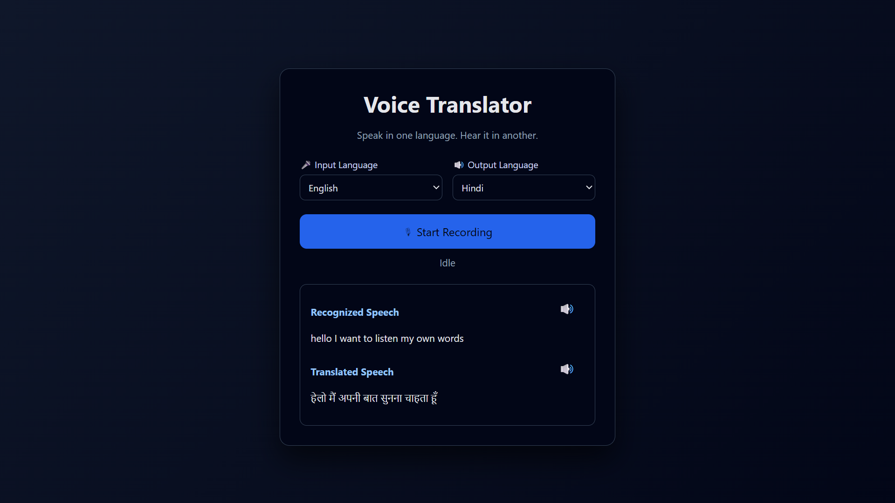

# Translator App


#### create a translator app which takes your voice/speech as an input (in the language you have selected, give 5 language choices) convert it to speech in the language you selected as output (in the output also give 5 language choices)


### Deployment
🔴 [**Demo Link**](https://ratnesh003.github.io/HCLTech-Tasks/Silver%20Badge%20Assignments/Assignment%203/frontend/index.html)

| Layer                  | Service                   |
| ---------------------- | ------------------------- |
| Frontend (HTML/CSS/JS) | **GitHub Pages**          |
| Backend (Flask API)    | **Render** |
| CI/CD                  | **GitHub Actions**        |

### Folder Structure

```
translator-app/
│
├── backend/
│   ├── app.py
│   ├── requirements.txt
│
├── frontend/
│   ├── index.html
│   ├── style.css
│   ├── script.js
```

### Tech stack
- Flask
- Deep Translator
- HTML
- CSS
- JavaScript

### How to setup

#### 1st step 
```
git clone https://github.com/ratnesh003/HCLTech-Tasks.git
```

 #### 2nd step
 ```
 cd "HCLTech-Tasks/Silver Badge Assignments/Assignment 3/backend"
 ```

 ### 3rd step
 ```
 py -m venv venv
 ```

 ### 4th step
 ```
 venv\Scripts\activate
 ```

 ### 5th step
 ```
 pip install -r requirements.txt
 ```

 ### 6th step
 ```
py app.py
```

### 7th step
In frontend folder open index.html right click on the file and Open with Live Server